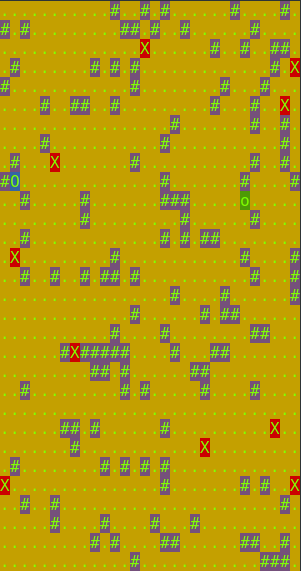

# Chase_Game
Simple terminal game has been written on Java for fun and pleasure

## Rules
**You** (player):

Have to get to the **goal**:

Your **enemy** rather angry and stupid, tries to terminate you:

**Walls** can help you to run away:

## How to play
Lets use these keys to move:

1) Up - 5
2) Down - 2
3) Left - 1
4) right - 3

For making a step just **push enter**:

## Installing the game

1) Just copy these instructions(beetwen two lines) in unix terminal and push enter
***********************************************************
mkdir target

javac -d target/ -sourcepath Game/src/main/java/ -cp Game/lib/\*  Game/src/main/java/edu/school21/game/app/Program.java ChaseLogic/src/main/java/edu/school21/chase/logic/*.java

cp -r Game/src/main/resources/*.* target

cd target
jar xf ../Game/lib/jcommander-1.78.jar
jar xf ../Game/lib/JCDP-4.0.2.jar
rm -rf META-INF
cd ..

jar cmf Game/manifest.txt game.jar -C target .
**********************************************************

## Start the game
just copy this in unix terminal 

java -jar game.jar --enemiesCount=10 --wallsCount=10 --size=30 --profile=production

You may change parameters as you want
--enemiesCount=
--wallsCount=
--size=

**I hope you will have fun!**
